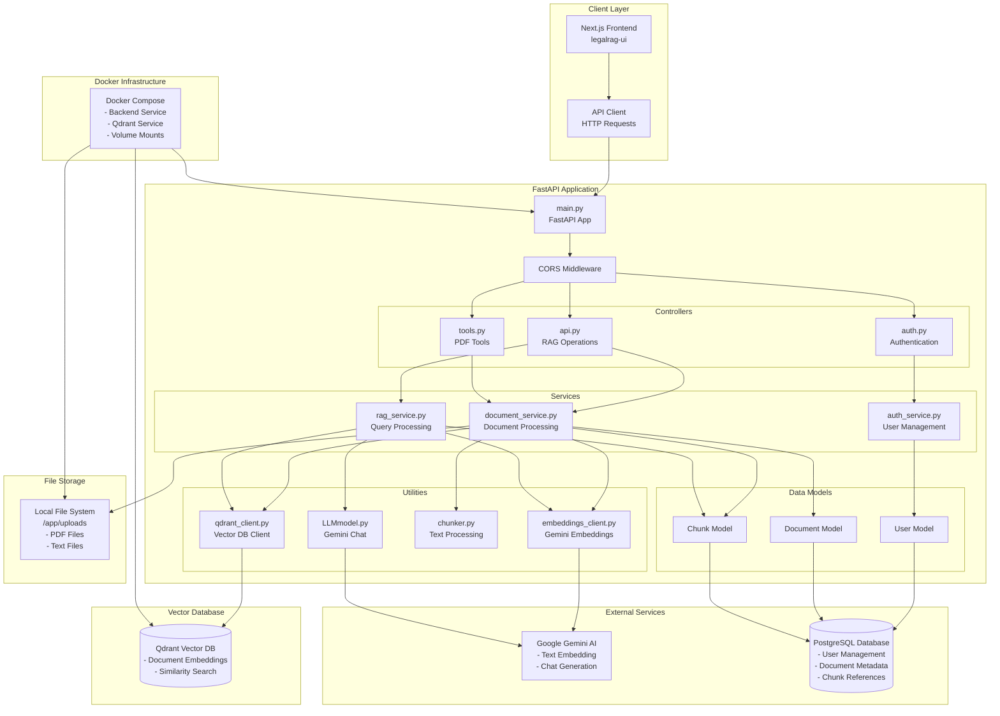

# Simple-RAG System Design

## System Architecture Overview

The Simple-RAG system is a Retrieval-Augmented Generation (RAG) application built with FastAPI that enables users to upload documents, process them into searchable chunks, and query them using natural language with AI-powered responses.

## System Architecture Diagram

## Component Details

### 1. **FastAPI Application Layer**
- **main.py**: Entry point that configures the FastAPI application with CORS middleware and route registration
- **Controllers**: Handle HTTP requests and responses
  - `auth.py`: User authentication endpoints (register, login, profile)
  - `api.py`: Core RAG operations (upload, query)
  - `tools.py`: Additional PDF processing tools (summarize, extract events)

### 2. **Service Layer**
- **auth_service.py**: User management operations (create, authenticate users)
- **document_service.py**: Document processing pipeline (upload, extract text, chunk, embed, store)
- **rag_service.py**: Query processing with advanced RAG techniques (query enhancement, HyDE, retrieval, generation)

### 3. **Data Models**
- **User**: Stores user credentials and profile information
- **Document**: Metadata about uploaded files (filename, path, owner, timestamp)
- **Chunk**: Text chunks with references to Qdrant vector IDs

### 4. **Utility Components**
- **embeddings_client.py**: Interface to Google Gemini text embedding API
- **qdrant_client.py**: Vector database operations (create collections, upsert vectors, search)
- **chunker.py**: Text extraction and chunking logic for various file formats
- **LLMmodel.py**: Interface to Google Gemini chat models

### 5. **External Dependencies**
- **Google Gemini AI**: Provides both text embeddings and chat generation capabilities
- **PostgreSQL**: Relational database for user management and document metadata
- **Qdrant**: Vector database for storing and searching document embeddings

## Data Flow

### Document Upload Flow
1. **Upload**: Client sends file to `/api/upload` endpoint
2. **Validation**: File type validation (PDF, TXT, DOC, DOCX)
3. **Storage**: File saved to local filesystem with unique UUID
4. **Text Extraction**: Content extracted using appropriate parser (pdfplumber for PDFs)
5. **Chunking**: Text split into overlapping chunks (1000 chars, 200 overlap)
6. **Embedding**: Each chunk converted to vector using Gemini embeddings
7. **Storage**: 
   - Document metadata stored in PostgreSQL
   - Chunk metadata stored in PostgreSQL
   - Vector embeddings stored in Qdrant

### Query Processing Flow
1. **Query Enhancement**: Original query enhanced using LLM for better retrieval
2. **HyDE Generation**: Hypothetical answer generated for improved semantic search
3. **Vector Search**: Enhanced query used to search Qdrant for relevant chunks
4. **Context Building**: Retrieved chunks combined into context
5. **Response Generation**: Context and original query sent to Gemini for final answer
6. **Response**: Natural language answer returned with source chunks

## Advanced RAG Features

### 1. **Query Enhancement**
- Uses Gemini to improve user queries for better retrieval accuracy
- Handles grammatical errors and makes queries more meaningful

### 2. **HyDE (Hypothetical Document Embeddings)**
- Generates hypothetical answers to queries
- Uses these hypothetical answers for improved semantic search
- Helps retrieve more relevant chunks

### 3. **Multi-Model Architecture**
- **Embedding Model**: `text-embedding-004` for vector generation
- **Chat Model**: `gemini-2.5-flash` for query enhancement and response generation
- **Lite Model**: `gemini-2.5-flash-lite` for HyDE generation

### 4. **User Isolation**
- Collections in Qdrant are user-specific (`user_{owner}`)
- Documents and chunks are associated with owners
- Enables multi-tenant architecture

## Security & Authentication

### 1. **JWT-Based Authentication**
- User registration and login with email/password
- JWT tokens for API access
- Password hashing with bcrypt

### 2. **CORS Configuration**
- Currently allows all origins (development setup)
- Should be restricted in production

### 3. **File Validation**
- Content type validation for uploads
- File size limits (handled by FastAPI)

## Deployment Architecture

### 1. **Docker Compose Setup**
- **Backend Service**: FastAPI application on port 8000
- **Qdrant Service**: Vector database on port 6333
- **Volume Mounts**: Persistent storage for uploads and Qdrant data

### 2. **Environment Configuration**
- PostgreSQL connection to Render cloud database
- Google Gemini API key configuration
- Model selection via environment variables

### 3. **Scalability Considerations**
- Stateless FastAPI application
- External PostgreSQL database
- Containerized Qdrant for easy scaling
- File storage can be moved to cloud storage (S3, etc.)

## Performance Optimizations

### 1. **Chunking Strategy**
- Overlapping chunks (200 chars) for better context preservation
- Sentence-aware splitting to avoid mid-sentence cuts
- Configurable chunk size (default 1000 chars)

### 2. **Vector Search**
- Cosine similarity for semantic search
- Configurable top-k retrieval (default 5)
- User-specific collections for faster search

### 3. **Response Generation**
- Temperature 0.0 for consistent responses
- Max output tokens limit (500) for focused answers
- Context cleaning to remove technical references

## Monitoring & Observability

### 1. **Logging**
- Print statements for query enhancement and HyDE generation
- Error handling with detailed error messages
- Response generation status tracking

### 2. **Health Checks**
- FastAPI automatic health endpoints
- Database connection validation
- Qdrant service availability

## Future Enhancements

### 1. **Advanced RAG Techniques**
- Re-ranking of retrieved chunks
- Multi-step reasoning
- Citation tracking and source attribution

### 2. **Performance Improvements**
- Async document processing
- Batch embedding generation
- Caching for frequent queries

### 3. **Security Enhancements**
- Rate limiting
- Input sanitization
- Audit logging

### 4. **Scalability**
- Horizontal scaling with load balancers
- Distributed vector search
- Cloud storage integration

This system provides a robust foundation for document-based question answering with modern RAG techniques, user management, and scalable architecture.
